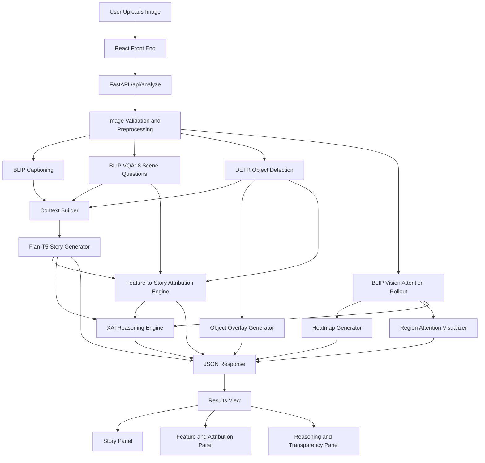

## 1. Title ~ ShotStory: Explainable Image-to-Story Generation Using Vision-Language Models and Multi-Level Attribution

## 2. Abstract

ShotStory is a full-stack explainable artificial intelligence system that converts an uploaded image into a multi-paragraph narrative while simultaneously showing why the generated story was produced. The central motivation behind the project is that many image-to-text systems can produce fluent outputs, but they rarely expose the visual evidence, intermediate reasoning, or confidence signals that shaped the final text. This lack of transparency becomes more serious when vision-language models are used in education, media support, accessibility tools, or creative assistance, where users need to inspect not only the result but also the evidence behind it. The present repository addresses that gap by combining image captioning, visual question answering, object detection, transformer-based attention analysis, story generation, and structured attribution reporting in a single interactive application.

The implemented system follows an inference-first architecture rather than a training-heavy experimental pipeline. A React and Tailwind front end accepts an image upload and presents multiple synchronized explanation views. A FastAPI back end processes the image through four main stages. First, the system performs visual understanding using BLIP image captioning, BLIP visual question answering, and DETR object detection. Second, it computes an attention rollout map from the BLIP vision encoder to estimate which image regions contributed most strongly to semantic interpretation. Third, it assembles the extracted caption, scene attributes, detected objects, and contextual cues into a structured prompt sequence for Flan-T5-based story generation. Instead of producing a single short caption, the narrative engine composes a six-paragraph story with contextual continuity across paragraphs. Fourth, the explainability layer creates attention overlays, object overlays, per-feature influence descriptions, feature-to-sentence mappings, a decision log, and a transparency summary. These outputs are returned to the client and rendered in panels that let the user inspect the original image, model attention, detected entities, generated text, and reasoning chain side by side.

One of the strongest design choices in ShotStory is that explainability is treated as a first-class system objective rather than a post-processing ornament. Prior research has shown that raw attention alone should not automatically be treated as a faithful explanation, so the repository supplements attention visualization with explicit feature-story attribution scores and textual reasoning summaries. This makes the system more useful for debugging, classroom demonstration, and human-in-the-loop interpretation. The codebase also reveals several practical engineering decisions that matter in real deployments: lazy model loading to reduce startup cost, automatic hardware selection across CPU, CUDA, and Apple MPS back ends, input validation for image type and size, image resizing for predictable processing, and a front-end timeout strategy that tolerates long first-run downloads of pretrained weights.

From a research perspective, ShotStory can be positioned as an explainable multimodal generation framework that sits between classical image captioning and richer visual storytelling systems. It does not train a new model from scratch, nor does it claim benchmark superiority. Instead, it demonstrates how pretrained vision-language components can be orchestrated into a transparent narrative-generation workflow. The repository is therefore well suited for an academic report that emphasizes architecture, explainability, and system methodology. The literature survey in this document connects the implementation to foundational work in captioning, visual question answering, transformer-based perception, and explainable AI, and the proposed-method section maps those ideas directly to the modules actually present in the codebase.

## 3. Keywords

Explainable AI, image captioning, visual question answering, object detection, vision-language models, narrative generation

## 4. Introduction

Recent progress in multimodal artificial intelligence has made it possible to describe images, answer questions about scenes, and generate natural language grounded in visual input. Early image captioning systems focused on producing a single descriptive sentence [1], later methods introduced attention mechanisms to focus on salient image regions during word generation [2], and visual question answering expanded scene understanding by forcing the model to answer targeted questions about objects, actions, mood, and context [3]. More recent transformer-based systems such as DETR [10], ViT [11], and BLIP [12] unified perception and language modeling with stronger transfer capability. Even so, most end-user systems still present only the final text output, leaving the model's internal reasoning opaque.

That opacity is a practical problem. If a system generates a story that mentions a person, a place, an emotion, or an event that does not clearly exist in the image, the user needs a way to inspect what the model actually saw and which visual features were responsible. In educational settings, this is essential for demonstrating how multimodal AI works. In creative systems, it is useful for debugging narrative drift. In accessibility-oriented applications, it helps users judge whether the generated output is reliable enough to trust. The main contribution of ShotStory is that it treats image-to-story generation and explainability as a joint problem rather than two disconnected tasks.

The repository implements ShotStory as a web application with a React front end and a FastAPI back end. The user uploads an image through a drag-and-drop interface, and the system responds with four tightly connected outputs: a generated story, a visual attention map, an object-detection overlay, and a structured explanation describing how scene attributes and detected objects influenced the story. Internally, the back end performs caption generation, targeted scene interrogation, object localization, attention rollout, story synthesis, and feature-to-story attribution. The front end then exposes these outputs in separate panels so that the user can inspect the original image, intermediate visual evidence, and textual reasoning without leaving the same screen.

A close reading of the codebase shows that the current implementation is best understood as a zero-shot inference pipeline built on pretrained models. The repository does not include a dedicated training script, curated benchmark split, or hyperparameter optimization loop. Instead, it relies on publicly available pretrained weights for BLIP, BLIP-VQA, DETR, and Flan-T5, then adds a custom orchestration layer for multimodal storytelling and explainability. That choice is not a weakness; it is part of the methodological character of the project. The research value lies in the integration strategy, the transparent reasoning outputs, and the user-facing visualization of model behavior.

This report therefore studies ShotStory as a system-design project for explainable image-to-story generation. The literature survey identifies the research threads that informed the pipeline, especially attention-guided captioning, VQA-based scene understanding, transformer-based object detection, and explainability beyond raw attention [2], [3], [6], [8], [9], [10], [12]. The proposed-method section then maps those ideas directly to the modules implemented in the repository, with particular emphasis on data flow, preprocessing, architecture, algorithmic workflow, hardware support, and software reproducibility.

## 5. Literature Survey and Analysis

The ShotStory pipeline sits at the intersection of five research streams: image captioning, paragraph- or story-level visual narration, visual question answering, transformer-based scene perception, and explainability for deep multimodal models. A good literature survey for this project should therefore do more than list papers. It should identify what each paper contributes, what limitation remains, and how that gap is addressed in the present system.

### 5.1 From Image Captioning to Richer Visual Narratives

Vinyals et al. introduced an early end-to-end neural captioning framework in Show and Tell [1], proving that an image could be mapped directly to a fluent sentence using a deep visual encoder and sequence decoder. Xu et al. improved that formulation by introducing visual attention in Show, Attend and Tell [2], allowing the model to focus on different regions during word generation. These works established the foundation for image-grounded text generation, but their outputs were typically concise and descriptive rather than narrative.

Later work pushed beyond single-sentence captions. Huang et al. presented Visual Storytelling [4], which emphasized temporally coherent, human-like narration over literal scene description. Krause et al. proposed hierarchical paragraph generation [5], demonstrating that richer textual outputs require multi-level structure rather than flat token decoding. These studies are highly relevant to ShotStory because the repository does not stop at captioning; it produces a six-paragraph story and uses contextual carryover between paragraphs. However, unlike full storytelling datasets that often assume image sequences, ShotStory applies narrative expansion to a single image and grounds that expansion in extracted scene cues.

### 5.2 Visual Question Answering as Structured Scene Understanding

Antol et al. formalized VQA as a task requiring both visual understanding and targeted reasoning [3]. This idea matters directly for ShotStory because the repository does not rely on a caption alone. Instead, it asks eight predefined questions about mood, setting, time of day, weather, main subject, activity, emotions, and dominant colors. This strategy turns scene understanding into a controllable information-extraction step. Anderson et al. later showed that object-aware attention improves both captioning and VQA [7], reinforcing the idea that richer textual generation benefits from explicit region-level evidence rather than only holistic image embeddings.

BLIP significantly strengthened this direction by unifying vision-language understanding and generation within one framework [12]. The ShotStory codebase uses BLIP both for captioning and VQA, making [12] one of the most directly relevant papers in the survey. Its importance lies not only in performance but in flexibility: a single pretrained family can support multiple downstream functions in the same pipeline.

### 5.3 Transformer-Based Perception and Multimodal Integration

The move from convolution-heavy pipelines to transformer-based perception reshaped modern visual AI. Dosovitskiy et al. showed in ViT that patch-based self-attention can serve as the main visual backbone [11]. Carion et al. applied transformer reasoning to object detection in DETR [10], removing several hand-engineered stages that dominated earlier detection pipelines. ShotStory directly inherits both ideas: its BLIP vision encoder depends on transformer-style visual representation, and its object localization stage is explicitly implemented with DETR.

For language generation, ShotStory uses Flan-T5 rather than a generic untuned decoder. Chung et al. demonstrated that instruction-finetuned language models can generalize strongly across unseen tasks and prompting formats [13]. This is an appropriate choice for the repository because the story generator is prompt-driven and depends on compositional textual context rather than supervised retraining on a new storytelling dataset.

### 5.4 Explainability: Beyond Raw Attention Heatmaps

Selvaraju et al. proposed Grad-CAM as a practical way to visualize discriminative image regions in deep networks [6]. Although ShotStory does not directly implement Grad-CAM, the paper remains relevant because it established the importance of local visual evidence in user-facing AI explanations. However, subsequent research warned that attention alone should not be equated with explanation. Jain and Wallace argued that attention weights can be weak or misleading explanatory proxies [8], while Abnar and Zuidema introduced attention rollout and attention flow as better approximations of information propagation through transformer layers [9].

These papers are central to the design logic of ShotStory. The repository computes a rollout-style attention map from BLIP's vision encoder, but it does not stop there. It supplements the map with object overlays, explicit scene attributes, feature-to-story attribution scores, sentence-level grounding, a decision log, and a transparency verdict. In other words, the code reflects the lesson from [8] and [9]: attention visualization is useful, but faithfulness improves when it is combined with additional structured evidence.

### 5.5 Comparative Literature Analysis

| Ref. | Paper                                         | Core contribution                                               | Main limitation                                                   | Relevance to ShotStory                                                       |
| ---- | --------------------------------------------- | --------------------------------------------------------------- | ----------------------------------------------------------------- | ---------------------------------------------------------------------------- |
| [1]  | Show and Tell                                 | End-to-end neural image caption generation                      | Produces short captions; limited interpretability                 | Establishes the captioning baseline that ShotStory extends into storytelling |
| [2]  | Show, Attend and Tell                         | Attention-guided caption generation                             | Attention alone is not a complete explanation                     | Motivates region-sensitive text generation and visual grounding              |
| [3]  | VQA: Visual Question Answering                | Structured multimodal reasoning through targeted questions      | Depends on suitable question design                               | Directly motivates ShotStory's eight-question scene probing stage            |
| [4]  | Visual Storytelling                           | Moves from description to narrative                             | Focuses on image sequences rather than single-image pipelines     | Supports narrative expansion beyond literal captioning                       |
| [5]  | Descriptive Image Paragraphs                  | Hierarchical generation of longer text                          | Still centered on description rather than explicit explainability | Inspires multi-paragraph narrative structure                                 |
| [6]  | Grad-CAM                                      | Visual explanation through localization maps                    | Coarse localization and modality dependence                       | Reinforces the need for evidence-aware visualization                         |
| [7]  | Bottom-Up and Top-Down Attention              | Object-level attention for captioning and VQA                   | Requires region-centric processing pipeline                       | Supports ShotStory's use of object detection as narrative anchors            |
| [8]  | Attention is not Explanation                  | Challenges naive faith in attention maps                        | Mostly studied in NLP settings                                    | Justifies adding reasoning logs and attribution scores beyond heatmaps       |
| [9]  | Quantifying Attention Flow in Transformers    | Proposes attention rollout and flow for better interpretability | Still post hoc, not full causal explanation                       | Closest conceptual match to ShotStory's attention-map construction           |
| [10] | DETR                                          | End-to-end transformer object detection                         | Computationally heavy compared with some detectors                | Directly used in the repository for object detection                         |
| [11] | ViT                                           | Patch-based transformer vision backbone                         | Requires large-scale pretraining                                  | Explains the transformer-style visual representation inside BLIP             |
| [12] | BLIP                                          | Unified vision-language understanding and generation            | Still depends on large pretrained corpora                         | Directly used for captioning and VQA in the repository                       |
| [13] | Scaling Instruction-Finetuned Language Models | Strong generalization through instruction tuning                | Not specific to visual storytelling                               | Supports the choice of Flan-T5 for prompt-driven story generation            |

### 5.6 Research Gap and Position of the Present Work

The literature shows a clear pattern. Captioning papers produce short descriptions [1], [2]. Storytelling papers produce richer narrative but often assume specialized datasets or image sequences [4], [5]. VQA papers improve controllable scene understanding [3], [7], [12]. Transformer papers improve perception and multimodal representation [10], [11], [12]. Explainability papers warn that attention alone is insufficient [6], [8], [9]. ShotStory combines these strands into one application-level contribution: a single-image storytelling system that exposes intermediate evidence, visual overlays, textual attributions, and an explicit reasoning chain. That integrative focus is the main novelty of the repository.

## 6. Proposed Method

### 6.1 Problem Statement

The objective of ShotStory is to generate a coherent and human-readable story from a single input image while providing transparent evidence for the generated text. Formally, given an image `I`, the system must produce:

1. A semantic caption `C` describing the scene.
2. A set of scene attributes `A = {mood, setting, time_of_day, weather, main_subject, activity, emotions, colors}`.
3. A set of detected objects `O = {o1, o2, ..., on}` with class labels, confidence scores, and bounding boxes.
4. A spatial attention map `M` highlighting visually important regions.
5. A multi-paragraph story `S` generated from `C`, `A`, `O`, and contextual prompting.
6. A set of explanations `E` linking visual evidence to specific story elements.

The research problem can therefore be stated as follows:

> How can a single-image storytelling system generate fluent narrative text without losing visual faithfulness, and how can the system expose enough intermediate evidence for a user to inspect why the story was produced?

The repository answers this by decomposing the task into six subproblems:

1. Robust image intake and preprocessing.
2. High-level caption extraction.
3. Attribute-level scene interrogation using VQA.
4. Object localization and confidence estimation.
5. Narrative synthesis using structured prompts and contextual carryover.
6. Multi-level explainability through heatmaps, overlays, attributions, and reasoning logs.

This formulation deliberately avoids treating story generation as a black box. Instead, the narrative is anchored to detected visual entities and explicit scene descriptors, which reduces uncontrolled hallucination and increases inspectability.

### 6.2 Dataset

The repository does not ship with a curated training dataset or benchmark split. As implemented, ShotStory is a zero-shot inference system that operates on user-supplied images and pretrained model knowledge. That fact should be stated clearly in the report because it affects how the project is evaluated: this is a system-integration and explainability prototype, not a from-scratch supervised training study.

The operational dataset for the running system is summarized below.

| Dataset element           | Source in current repository                         | Characteristics                                                     | Role in pipeline                                                   |
| ------------------------- | ---------------------------------------------------- | ------------------------------------------------------------------- | ------------------------------------------------------------------ |
| Runtime image input       | User upload through web UI                           | PNG, JPG, JPEG, or WebP; up to 10 MB; converted to RGB              | Primary inference input                                            |
| Preprocessed image tensor | Generated during request handling                    | Largest dimension resized to 800 px; normalized by model processors | Stable input for captioning, VQA, detection, and attention         |
| Sample image              | `backend/test_image.jpg`                             | Single static example file                                          | Smoke testing / manual demo support                                |
| Semantic priors           | Pretrained BLIP, BLIP-VQA, DETR, and Flan-T5 weights | Downloaded on first run; reused via local cache                     | Provide captioning, reasoning, detection, and narrative capability |

For reproducibility, the data preparation stage performs the following operations on every uploaded image:

1. Validate that the uploaded content is an image or browser-supplied octet stream.
2. Read raw bytes and reject empty files.
3. Open the image with Pillow and convert non-RGB formats to RGB.
4. Resize the image if its largest dimension exceeds 800 pixels.
5. Forward the processed image into the captioning, VQA, and detection modules.

Although the repository does not include a benchmark dataset, the pretrained models it uses were originally developed on large-scale public corpora, including image-text pairs, captioning datasets, and detection benchmarks discussed in the underlying papers [3], [10], [12]. In other words, ShotStory's generalization ability comes from model pretraining, while its contribution lies in multimodal orchestration and explainability. If the team later wants to perform quantitative evaluation, a separate held-out benchmark of diverse real-world images should be assembled and reported independently from the present repository.

### 6.3 Architecture Diagram

The overall architecture extracted from the codebase is shown below.



The architecture has three important characteristics:

1. It is modular. Captioning, VQA, detection, explanation, and narrative synthesis are separated into service classes.
2. It is evidence-preserving. Intermediate outputs are not discarded after story generation; they are serialized and returned to the client.
3. It is user-facing in its transparency. The front end is designed to expose attention maps, detection overlays, attributes, and reasoning logs in parallel with the final story.

### 6.4 Workflow / Methodology

The methodology implemented in ShotStory can be explained as a deterministic control flow wrapped around pretrained neural components.

#### 6.4.1 Algorithm

**Workflow summary**

1. Accept a user-uploaded image through the front end.
2. Validate format and size, then preprocess it.
3. Generate a caption using BLIP captioning.
4. Ask eight scene questions using BLIP-VQA to obtain structured attributes.
5. Detect objects and bounding boxes using DETR.
6. Compute a ViT-based attention rollout map from BLIP's vision encoder.
7. Build a narrative context from caption, scene attributes, and object list.
8. Generate a six-paragraph story using Flan-T5 with chained prompts.
9. Produce explanation visuals and structured attributions.
10. Generate a reasoning chain, decision log, sentence map, and transparency summary.
11. Return all artifacts to the front end for synchronized display.

**Algorithm 1: Explainable image-to-story generation**

```text
Input: Uploaded image I
Output: Story S, caption C, attributes A, objects O, attention map M, explanations E

1.  Validate I and read image bytes
2.  Convert I to RGB and resize if max dimension > 800
3.  C <- BLIP_Caption(I)
4.  For each question q in Q:
5.      A[q] <- BLIP_VQA(I, q)
6.  O <- DETR_Detect(I, threshold = 0.5)
7.  M <- Attention_Rollout(BLIP_Vision_Encoder(I))
8.  Context <- Compose(C, A, O)
9.  S <- Generate_Story_FlanT5(Context, chained_paragraph_prompts)
10. H1 <- Heatmap_Overlay(I, M)
11. H2 <- Object_Overlay(I, O)
12. E1 <- Feature_Story_Attributions(A, O, S)
13. E2 <- XAI_Reasoning(C, A, O, M, S, E1)
14. Return {C, A, O, M, S, H1, H2, E1, E2}
```

**Module-level methodology**

**a. Image preprocessing**

The input image is decoded with Pillow, converted to RGB when required, and resized to a maximum dimension of 800 pixels. This makes the pipeline less sensitive to extremely large uploads while preserving sufficient detail for captioning and object detection.

**b. Caption generation**

The system uses `Salesforce/blip-image-captioning-base` to generate a scene-level caption. This caption acts as the first semantic summary and later helps determine the story subject and title [12].

**c. Scene interrogation through VQA**

Instead of trusting a single caption to contain all relevant detail, the system asks eight fixed questions: mood, setting, time of day, weather, main subject, activity, emotions, and colors. This step enriches the scene representation with structured metadata inspired by the reasoning-based spirit of VQA systems [3], [12].

**d. Object detection**

The system uses `facebook/detr-resnet-50` to detect concrete visual entities and bounding boxes [10]. Each detection includes a label, confidence score, and coordinates. These objects later serve as narrative anchors and explanation units.

**e. Attention rollout**

The attention module extracts attention tensors from BLIP's vision encoder, averages attention heads layer by layer, injects residual identity, normalizes the matrices, and multiplies them cumulatively to obtain a rollout-style relevance map. The final class-token-to-patch attention is reshaped into a spatial grid and normalized. This design closely follows the intuition of attention rollout proposed in transformer interpretability research [9], while acknowledging that attention is only one explanatory signal among several [8].

**f. Story generation**

The story engine loads `google/flan-t5-large` and selects the best available device in this order: Apple MPS, CUDA, or CPU. It then builds six paragraph prompts. If the image appears person-centric, it chooses a name and pronoun strategy; otherwise, it frames the narrative through an observer. Each subsequent paragraph receives a summary of earlier paragraphs, which maintains continuity across the story. The final text is lightly cleaned to remove prompt artifacts and preserve only readable prose. This prompt-chaining method is simpler than full supervised storytelling pipelines, but it is effective for an explainable application because every paragraph can still be traced back to the same extracted visual context [4], [5], [13].

**g. Feature-to-story attribution**

The explainer computes importance scores by combining text-overlap relevance with detection confidence. For detected objects, the importance score is approximately:

`importance(object) = relevance(label, story_text) x confidence`

For scene attributes, the score uses a lower-bounded relevance estimate:

`importance(attribute) = max(0.3, relevance(value, story_text))`

This produces an ordered list of visual features ranked by likely narrative influence.

**h. Reasoning chain and transparency summary**

The XAI reasoner converts the raw intermediate outputs into human-readable sections:

1. Stepwise reasoning chain
2. Decision log by model and module
3. Feature-to-sentence grounding map
4. Transparency summary with feature coverage

This final step is important because it converts machine outputs into a format suitable for inspection by non-expert users.

#### 6.4.2 Hardware

The repository is designed to run on multiple hardware configurations. The code does not hardcode one training machine; instead, it dynamically selects the best available inference device. The practical hardware profile for reproducible usage is summarized below.

| Hardware component      | Requirement / support in repository | Remarks                                                          |
| ----------------------- | ----------------------------------- | ---------------------------------------------------------------- |
| CPU                     | Required                            | Works on standard CPU-only systems, but inference is slower      |
| GPU (NVIDIA CUDA)       | Optional and supported              | Used automatically when CUDA is available                        |
| Apple Silicon GPU (MPS) | Optional and supported              | Used automatically when MPS is available                         |
| RAM                     | 8 GB minimum, 16 GB recommended     | Multiple pretrained models are loaded in memory                  |
| Storage                 | Approximately 2-3 GB free space     | Needed for first-run download and local caching of model weights |
| Operating system        | Windows, macOS, or Linux            | Front end and back end are both cross-platform                   |

From the codebase, two practical observations are clear:

1. First-run execution is model-download heavy, so storage and network access matter.
2. Inference latency is strongly improved when CUDA or MPS is available, especially for story generation and multimodal analysis.

#### 6.4.3 Software

The repository exposes a reproducible software stack through `requirements.txt` and `package.json`. The important components are listed below.

| Layer                        | Technology       | Version / status | Purpose                              |
| ---------------------------- | ---------------- | ---------------- | ------------------------------------ |
| Backend framework            | FastAPI          | 0.104.1          | REST API for image analysis          |
| ASGI server                  | Uvicorn          | 0.24.0           | Development server                   |
| Deep learning                | PyTorch          | >= 2.0.0         | Tensor execution and device handling |
| Vision-language library      | Transformers     | >= 4.35.0        | BLIP, DETR, Flan-T5 loading          |
| Vision utilities             | Torchvision      | >= 0.15.0        | Vision support for PyTorch           |
| Image processing             | Pillow           | 10.1.0           | Image decoding and conversion        |
| Numerical computing          | NumPy            | >= 1.24.0        | Array operations                     |
| Visualization                | Matplotlib       | >= 3.7.0         | Heatmap and overlay creation         |
| Signal / image interpolation | SciPy            | >= 1.11.0        | Attention-map resizing               |
| Upload handling              | python-multipart | 0.0.6            | Multipart form processing            |
| Front end library            | React            | 18.3.1           | User interface                       |
| Build tool                   | Vite             | 5.2.11           | Front-end bundling and dev server    |
| Styling                      | Tailwind CSS     | 3.4.3            | Component styling                    |
| Animation                    | Framer Motion    | 11.0.0           | UI transitions                       |
| Networking                   | Axios            | 1.7.2            | Front-end API communication          |
| Upload UX                    | react-dropzone   | 14.2.3           | Drag-and-drop image input            |

The front-end methodology is not merely cosmetic. It plays a research-support role by displaying the explanation artifacts in separate but coordinated panels:

1. Attribution map panel for original image, attention overlay, and object overlay.
2. Feature panel for caption, scene attributes, detected objects, and ranked attributions.
3. XAI reasoning panel for the chain of reasoning, decision log, sentence mapping, and transparency verdict.

This UI design makes the system suitable for demonstrations, coursework reviews, and human-centered evaluation of explainable AI outputs.

## 7. References

[1] O. Vinyals, A. Toshev, S. Bengio, and D. Erhan, "Show and Tell: A Neural Image Caption Generator," in _Proceedings of the IEEE Conference on Computer Vision and Pattern Recognition (CVPR)_, 2015, pp. 3156-3164. Available: https://www.cv-foundation.org/openaccess/content_cvpr_2015/html/Vinyals_Show_and_Tell_2015_CVPR_paper.html

[2] K. Xu, J. Ba, R. Kiros, K. Cho, A. Courville, R. Salakhudinov, R. Zemel, and Y. Bengio, "Show, Attend and Tell: Neural Image Caption Generation with Visual Attention," in _Proceedings of the 32nd International Conference on Machine Learning (ICML)_, vol. 37, 2015, pp. 2048-2057. Available: https://proceedings.mlr.press/v37/xuc15.html

[3] S. Antol, A. Agrawal, J. Lu, M. Mitchell, D. Batra, C. L. Zitnick, and D. Parikh, "VQA: Visual Question Answering," in _Proceedings of the IEEE International Conference on Computer Vision (ICCV)_, 2015, pp. 2425-2433. Available: https://openaccess.thecvf.com/content_iccv_2015/html/Antol_VQA_Visual_Question_ICCV_2015_paper

[4] T.-H. K. Huang, F. Ferraro, N. Mostafazadeh, I. Misra, A. Agrawal, J. Devlin, R. Girshick, X. He, P. Kohli, D. Batra, C. L. Zitnick, D. Parikh, L. Vanderwende, M. Galley, and M. Mitchell, "Visual Storytelling," in _Proceedings of the 2016 Conference of the North American Chapter of the Association for Computational Linguistics: Human Language Technologies_, 2016, pp. 1233-1239. doi: 10.18653/v1/N16-1147. Available: https://aclanthology.org/N16-1147/

[5] J. Krause, J. Johnson, R. Krishna, and L. Fei-Fei, "A Hierarchical Approach for Generating Descriptive Image Paragraphs," in _Proceedings of the IEEE Conference on Computer Vision and Pattern Recognition (CVPR)_, 2017, pp. 317-325. Available: https://openaccess.thecvf.com/content_cvpr_2017/html/Krause_A_Hierarchical_Approach_CVPR_2017_paper.html

[6] R. R. Selvaraju, M. Cogswell, A. Das, R. Vedantam, D. Parikh, and D. Batra, "Grad-CAM: Visual Explanations From Deep Networks via Gradient-Based Localization," in _Proceedings of the IEEE International Conference on Computer Vision (ICCV)_, 2017, pp. 618-626. Available: https://openaccess.thecvf.com/content_iccv_2017/html/Selvaraju_Grad-CAM_Visual_Explanations_ICCV_2017_paper.html

[7] P. Anderson, X. He, C. Buehler, D. Teney, M. Johnson, S. Gould, and L. Zhang, "Bottom-Up and Top-Down Attention for Image Captioning and Visual Question Answering," in _Proceedings of the IEEE Conference on Computer Vision and Pattern Recognition (CVPR)_, 2018, pp. 6077-6086. Available: https://openaccess.thecvf.com/content_cvpr_2018/html/Anderson_Bottom-Up_and_Top-Down_CVPR_2018_paper.html

[8] S. Jain and B. C. Wallace, "Attention is not Explanation," in _Proceedings of the 2019 Conference of the North American Chapter of the Association for Computational Linguistics: Human Language Technologies_, vol. 1, 2019, pp. 3543-3556. doi: 10.18653/v1/N19-1357. Available: https://aclanthology.org/N19-1357/

[9] S. Abnar and W. Zuidema, "Quantifying Attention Flow in Transformers," in _Proceedings of the 58th Annual Meeting of the Association for Computational Linguistics_, 2020, pp. 4190-4197. doi: 10.18653/v1/2020.acl-main.385. Available: https://aclanthology.org/2020.acl-main.385/

[10] N. Carion, F. Massa, G. Synnaeve, N. Usunier, A. Kirillov, and S. Zagoruyko, "End-to-End Object Detection with Transformers," in _Computer Vision - ECCV 2020: 16th European Conference, Proceedings, Part I_, 2020, pp. 213-229. doi: 10.1007/978-3-030-58452-8_13. Available: https://www.ecva.net/papers/eccv_2020/papers_ECCV/html/832_ECCV_2020_paper.php

[11] A. Dosovitskiy, L. Beyer, A. Kolesnikov, D. Weissenborn, X. Zhai, T. Unterthiner, M. Dehghani, M. Minderer, G. Heigold, S. Gelly, J. Uszkoreit, and N. Houlsby, "An Image is Worth 16x16 Words: Transformers for Image Recognition at Scale," in _International Conference on Learning Representations (ICLR)_, 2021. Available: https://openreview.net/forum?id=YicbFdNTTy

[12] J. Li, D. Li, C. Xiong, and S. Hoi, "BLIP: Bootstrapping Language-Image Pre-training for Unified Vision-Language Understanding and Generation," in _Proceedings of the 39th International Conference on Machine Learning (ICML)_, vol. 162, 2022, pp. 12888-12900. Available: https://proceedings.mlr.press/v162/li22n.html

[13] H. W. Chung, L. Hou, S. Longpre, B. Zoph, Y. Tay, W. Fedus, Y. Li, X. Wang, M. Dehghani, S. Brahma, A. Webson, S. S. Gu, Z. Dai, M. Suzgun, X. Chen, A. Chowdhery, A. Castro-Ros, M. Pellat, K. Robinson, D. Valter, S. Narang, G. Mishra, A. Yu, V. Zhao, Y. Huang, A. Dai, H. Yu, S. Petrov, E. H. Chi, J. Dean, J. Devlin, A. Roberts, D. Zhou, Q. V. Le, and J. Wei, "Scaling Instruction-Finetuned Language Models," _Journal of Machine Learning Research_, vol. 25, no. 70, pp. 1-53, 2024. Available: https://jmlr.org/beta/papers/v25/23-0870.html
